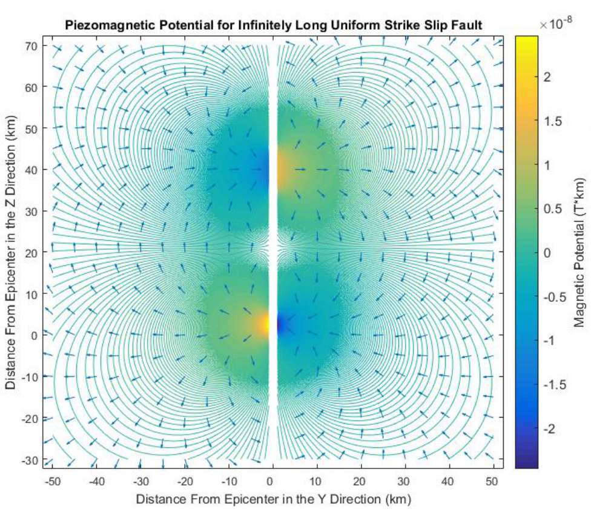

# Piezomagnetic Simulation
A MATLAB simulation of the piezomagnetic effects due to seismic activity as presented in Sasai (1980)

## Getting Started

In order to run the simulation, the only requirement is a recent (2015 or later) version of MATLAB installed on your system. Simply clone the repository and load it into the MATLAB IDE. Then run `run_simulation.m` which will run the GUI to view the simulation.

## Built With

* [MATLAB](https://www.mathworks.com/products/matlab.html) - developed using R2015b, but any recent version should function.

## Contributing

1. Fork the project
2. Create your feature branch (`git checkout -b feature/fooBar`)
3. Commit your changes (`git commit -am 'Add some fooBar'`)
4. Push to the branch (`git push origin feature/fooBar`)
5. Create a new Pull Request

## Authors

* Initial work on the simulation was designed by [**Caleb Vatral**](https://github.com/kbvatral) and **Joshua Lojzim**

This simulation was developed for [Eastern Nazarene College](https://github.com/encresearch).

## License

This project is licensed under the MIT License - see the [LICENSE](LICENSE) file for details

## Acknowledgments

* The basis of this simulation is a paper by Sasai written 1980
* Special thanks to Dr. Pierre-Richard Cornely, who is the PI for all ENC Engineering Research efforts

